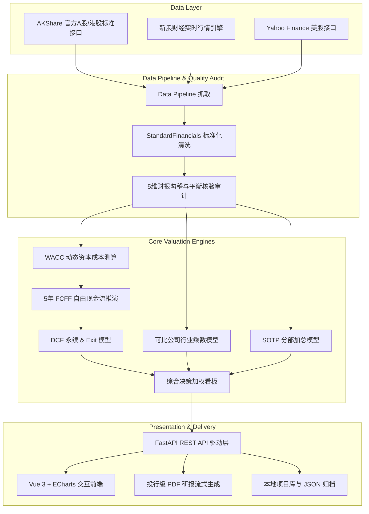

<div align="center">

# 📈 Company Valuation Terminal
### 专业级上市公司全维智能估值终端

[](https://www.python.org/)
[](https://fastapi.tiangolo.com/)
[](https://vuejs.org/)
[](https://vitejs.dev/)
[](https://echarts.apache.org/)
[](LICENSE)

<p align="center">
  <b>融合内生价值（DCF 现金流折现）、相对估值（可比公司行业倍数）、分部加总（SOTP）与敏感性决策矩阵</b><br>
  涵盖 <b>A股 (沪深北)</b> · <b>港股 (HK)</b> · <b>美股 (US)</b> 全市场真实财报数据清洗、严密勾稽核验与投行级研报一键导出
</p>

</div>

---

## 🌟 核心亮点与特色 (Key Highlights)

### 1. 🔍 全市场智能搜索与即时联想 (Universal Stock Search)
- **多维度智能解析**：支持直接输入股票代码（如 `601138`、`00700`、`NVDA`）、公司全称、简称或**拼音缩写**（如 `tx` 查腾讯，`gyfl` 查工业富联，`lcdz` 查联创电子）。
- **极佳容错与补全**：
  - 自动识别并剥离市场前缀/后缀（如 `HK00100`、`601138.SS`、`002036.SZ`）；
  - 港股 1~4 位短代码自动补全为 5 位标准代码（如 `100` ➔ `00100`，`700` ➔ `00700`）；
  - 首页居中大搜索框自带全市场分类 Tabs（全市场、港股、美股、A股）与热门明星标的一键直达。

### 2. 🛡️ 财报数据真实性核验与审计链条 (Audit & Verification Pipeline)
- **权威数据源背书**：底层对接官方标准财报接口（AKShare / 新浪财经 / Yahoo Finance），覆盖连续 4~5 年完整历史财报。
- **五维财报勾稽与平衡性自动核验**：
  1. **资产负债表平衡校验**：`资产总计 = 负债合计 + 所有者权益合计`，误差控制在 $\pm 0.01\%$ 以内；
  2. **营业收入真实性校验**：确认基准期营业总收入真实抓取且币种严格对齐；
  3. **利润表净利润勾稽校验**：营收、毛利、EBIT 息税前利润与净利润逻辑自洽无断层；
  4. **现金流净额核验**：确认经营活动现金流净额合法注入；
  5. **行情市价与总股本校准**：实时收盘价与稀释总股本精准配对，校准基准市值。
- **参数注入公开透明**：明细展示注入内生估值引擎的核心基准参数（基准营收、EBIT、净利润、货币资金、有息负债、净负债、稀释总股本、现价、市值）。

### 3. 📊 五大投行级专业估值模型 (Valuation Models)
- **DCF Gordon 永续增长法**：基于 5 年 UFCF 自由现金流投影与终值永续折现。
- **DCF Exit 退出乘数法**：基于 EV/EBITDA 乘数推算终值与企业价值。
- **可比公司 P/E 市盈率法**：动态拉取行业对标池中位数与合理价值区间。
- **可比公司 EV/EBITDA 倍数法**：剥离资本结构差异的纯企业经营估值。
- **SOTP 分部加总估值法**：针对多元化业务集团（如腾讯、小米、阿里等），支持拆解核心业务分部，提供乐观、基准、悲观三档情境测算。

### 4. 📄 投行级 PDF 研报一键即时导出 (Instant PDF Report)
- 顶部导航栏 **「📄 导出当前PDF」** 秒级生成高品质研报；
- 内置微软黑体（MS YaHei）全中文矢量排版，绝无乱码；
- 研报第一章节即为 **《财报数据真实性核验与参数注入》**，附带完整 5 年财务投影、资本成本推演与加权公允价值结论，直出即用。

---

## 🏛️ 系统架构 (System Architecture)



---

## 📂 项目目录结构 (Directory Layout)

```
company-valuation-terminal/
├── backend/                        # 后端服务 (Python / FastAPI)
│   ├── app/
│   │   ├── api/                    # 路由、控制器与 PDF 导出
│   │   │   ├── main.py             # FastAPI 入口
│   │   │   ├── routes.py           # 核心 REST 路由与审计校验逻辑
│   │   │   ├── orchestrator.py     # 估值计算调度器
│   │   │   ├── pdf_export.py       # 投行级 PDF 研报生成器
│   │   │   └── store.py            # SQLite 项目库存储
│   │   ├── data/                   # 数据接入与清洗
│   │   │   ├── pipeline.py         # 财报获取与标准科目转换管道
│   │   │   ├── stock_lookup.py     # 智能证券代码/拼音/名称字典与实时解析
│   │   │   ├── mapper.py           # 会计科目多市场映射引擎
│   │   │   ├── models.py           # Pydantic 财务数据模型
│   │   │   └── providers/          # AKShare / yfinance / 新浪行情提供方
│   │   ├── valuation/              # 纯数值估值模型算法库
│   │   │   ├── dcf.py              # DCF 现金流折现算法
│   │   │   ├── comps.py            # 行业相对倍数法
│   │   │   ├── sotp.py             # 分部加总法
│   │   │   ├── wacc.py             # 加权平均资本成本推演
│   │   │   └── summary.py          # 综合决策权重矩阵
│   │   └── config/                 # 市场配置、折现率基准与 SOTP 预设
│   ├── tests/                      # 单元测试与端到端测试套件
│   ├── pytest.ini
│   └── requirements.txt            # Python 依赖清单
│
├── frontend/                       # 前端终端 (Vue 3 / Vite / ECharts)
│   ├── src/
│   │   ├── App.vue                 # 终端主布局、主页主搜索框与侧边栏
│   │   ├── api.js                  # Axios 接口封装
│   │   ├── store.js                # 响应式状态管理 (含审计核验状态)
│   │   ├── components/             # 各估值模型与交互组件
│   │   │   ├── CompanyProfileView.vue # 标的档案 & 财报真实性核验报告卡片
│   │   │   ├── Overview.vue        # 历年财务全景与多轴走势图
│   │   │   ├── Assumptions.vue     # 核心假设参数动态调整面板
│   │   │   ├── DCFView.vue         # 现金流折现明细与敏感性热力矩阵
│   │   │   ├── CompsView.vue       # 可比同行多倍数对标分析
│   │   │   ├── SOTPView.vue        # 业务分部加总看板
│   │   │   └── SummaryView.vue     # 足球场图 (Football Field) 与综合评级
│   │   └── utils/
│   │       └── stockDictionary.js  # 本地智能速查字典 (含 MiniMax/智谱/工业富联等)
│   ├── package.json
│   └── vite.config.js
│
└── README.md                       # 项目主说明文档
```

---

## ⚡ 快速开始 (Quick Start)

### 1. 环境准备 (Prerequisites)
- **Python**: 3.10 或更高版本 (推荐 3.11)
- **Node.js**: 18.0 或更高版本 (推荐 20.x)
- **操作系统**: Windows / Linux / macOS (Windows 环境自带完整中文字体支持)

---

### 2. 后端部署 (Backend)

```bash
# 1. 进入后端目录
cd backend

# 2. 创建并激活虚拟环境 (可选但推荐)
# Windows:
python -m venv venv
venv\Scripts\activate
# Linux / macOS:
# python3 -m venv venv && source venv/bin/activate

# 3. 安装依赖包
pip install -r requirements.txt

# 4. 运行单元测试确认环境正常
pytest tests/test_cn_pipeline.py

# 5. 启动后端 API 服务 (端口 8000)
uvicorn app.api.main:app --host 127.0.0.1 --port 8000 --reload
```

> 后端服务就绪后，访问 API 文档：[http://127.0.0.1:8000/docs](http://127.0.0.1:8000/docs)

---

### 3. 前端启动 (Frontend)

```bash
# 1. 打开新终端，进入前端目录
cd frontend

# 2. 安装 NPM 依赖
npm install

# 3. 启动 Vite 开发热更新服务器 (端口 5173)
npm run dev
```

> 打开浏览器访问估值终端：**[http://127.0.0.1:5173](http://127.0.0.1:5173)**

---

## 💡 使用演示与操作指南 (Walkthrough)

1. **首页主搜索检索**：
   - 打开首页，在中央大搜索框输入任意感兴趣的代码或名称：
     - 输入 `00100` 或 `MiniMax` 体验港股 AI 独角兽企业估值；
     - 输入 `601138` 或 `工业富联` / `gyfl` 体验 A股高端制造与算力龙头；
     - 输入 `00700` 或 `腾讯` 体验 SOTP 分部多元业务加总；
     - 输入 `AAPL` 或 `NVDA` 体验美股硬科技巨头。
2. **查验财报核验卡片**：
   - 系统自动抓取真实财报后，首先展示 **《财报数据真实性核验与估值引擎注入确认》**；
   - 确认 5 项勾稽平衡全部通过，核对基准营业收入、净负债与稀释总股本。
3. **多模型联动推演**：
   - 在侧边栏随时切换 **DCF 永续增长法**、**Exit 乘数法**、**P/E 与 EV/EBITDA 可比对标**、**SOTP 分部加总**；
   - 调整任意增长率、毛利率或折现率假设，全模型毫秒级实时联动重算。
4. **一键生成研报**：
   - 点击顶部右上角 **「📄 导出当前PDF」**，即刻下载排版优美的机构级估值研报。

---

## 🧮 核心估值方法论公式 (Methodology)

### 1. 无杠杆自由现金流 (UFCF)
$$\text{UFCF} = \text{EBIT} \times (1 - t) + \text{D\&A} - \Delta\text{NWC} - \text{CapEx}$$

### 2. 加权平均资本成本 (WACC)
$$\text{WACC} = \frac{E}{V} \times K_e + \frac{D}{V} \times K_d \times (1 - t)$$
其中股权成本采用资本资产定价模型 (CAPM)：
$$K_e = R_f + \beta \times \text{ERP}$$

### 3. DCF 终值 (Terminal Value)
- **Gordon 永续法**：
  $$\text{TV}_{\text{gordon}} = \frac{\text{UFCF}_5 \times (1 + g)}{\text{WACC} - g}$$
- **Exit 退出倍数法**：
  $$\text{TV}_{\text{exit}} = \text{EBITDA}_5 \times \text{Exit Multiple}$$

### 4. 企业价值到股权价值桥接 (EV-to-Equity Bridge)
$$\text{Equity Value} = \text{Enterprise Value} + \text{Cash} - \text{Total Debt}$$
$$\text{Implied Price} = \frac{\text{Equity Value}}{\text{Diluted Shares}}$$

---

## 🔒 免责声明 (Disclaimer)

本系统是一款上市公司智能估值计算与辅助研究工具。
1. 计算结果完全基于公开披露的历史财报及用户设定的假设参数；
2. 工具输出的所有内在公允价值、目标价格、敏感性分析与综合评级**不构成任何形式的投资建议、投资要约或买卖推荐**；
3. 现金流折现模型及倍数对宏观折现率、终值增长率等输入参数具有高度敏感性，实际投资应结合公司最新经营基本面进行审慎、独立的尽职调查与决策。

---

<div align="center">
  <sub>Built with ❤️ for quantitative investors, analysts & valuation enthusiasts.</sub>
</div>
